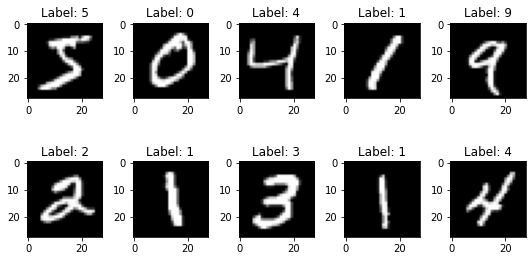
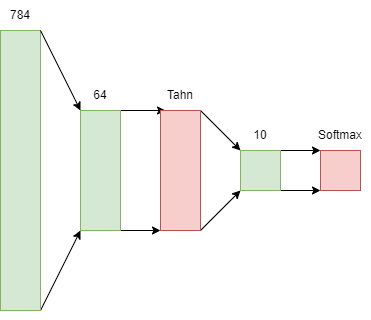
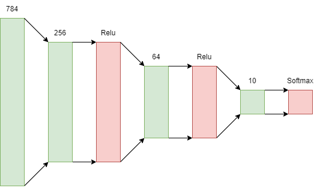

## Overview
In artificial intelligence, undeniably one of the most importants and widely used machine learning algorithms is the [Neural Network](https://en.wikipedia.org/wiki/Neural_network). While I was learning about neural networks, to understand the concept at its core, I opted to create a simple neural network classifier model completely from scratch using only [Numpy](https://numpy.org/) rather than a framework like [TensorFlow](https://www.tensorflow.org/) or [PyTorch](https://pytorch.org/).

My implementation is aimed to be used a used to classify images of handwritten digits, specifically the [MNIST](https://en.wikipedia.org/wiki/MNIST_database) dataset.

## The Dataset
The MNIST dataset is a set of handwritten digits that is used to train a neural network to classify the digits. The dataset is split into a training set and a test set where the training set is used to train the neural network and the test set is used to test the neural network. 

It is made up of 60,000 training images and 10,000 test images of a size of 28x28 pixels. The images are stored in a matrix of size 60,000 x 784, where each row represents a 28x28 pixel image. The first column represents the first pixel of the first image, the second column represents the second pixel of the first image, and so on.

The images look like this:

## The Code

The create my neural network, I wanted to create something relatively generic that I easily modify so that I could experiment with a number of different archittecures consisting of different number of layers, layer sizes, and activation functions. Thus, I implemented a generic neural network class that allows me to easily create a neural network with a number of different architectures rather than manually creating each layer.

## The Models
To demonstrate the generic neural network class, I have implemented the three following models that I have used to train the neural network to varying degrees of success.

### Model 1
The first model is a simple neural network with a single hidden layer and uses the [tanh](https://en.wikipedia.org/wiki/Hyperbolic_function) activation function with a softmax output activation function.

### Model 2
The second model is a simple neural network also with a single hidden layer and a softmax output activation function; however, this time the other activation functions are the [sigmoid](https://en.wikipedia.org/wiki/Sigmoid_function) function.

### Model 3
The third model is a simple neural network with two hidden layers and uses the [relu](https://en.wikipedia.org/wiki/Rectifier_%28neural_networks%29) activation function with a softmax output activation function.

## Models Performance
The following table shows the accuracy of the three models trained on the MNIST dataset.

The following training parameters were used:
- `learning_rate`: 0.01
- `batch_size`: 128
- `epochs`: 10
- `momentum`: 1e-3

With the aforementioned parameters, the models performance were as follows:

| Model       | Testing Set Accuracy |
| ----------- | -------------------- |
| Model 1     | 85.81%               |
| Model 2     | 87.25%               |
| Model 3     | 96.49%               |